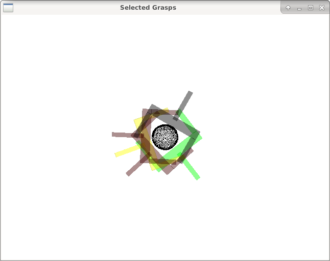

# Grasp Pose Detection (GPD)

* **Author:** Andreas ten Pas (atp@ccs.neu.edu)
* **Version:** 1.0.0
* **Author's website:** [http://www.ccs.neu.edu/home/atp/](http://www.ccs.neu.edu/home/atp/)
* **License:** BSD

## Overview

This package detects 6-DOF grasp poses (3-DOF position and 3-DOF orientation)
for a 2-finger robot hand (e.g., a parallel jaw gripper) in 3D point clouds.

##### UR5 Video

<a href="http://www.youtube.com/watch?feature=player_embedded&v=kfe5bNt35ZI
" target="_blank"></a>

Grasp pose detection (GPD) consists of three steps: sampling a large number of grasp
candidates, classifying these candidates as viable grasps or not, and clustering
viable grasps which are geometrically similar.

##### Example Input and Output


The reference for this package is:
[Grasp Pose Detection in Point Clouds](http://arxiv.org/abs/1706.09911).

## Table of Contents
1. [Requirements](#requirements)
1. [Installation](#install)
1. [Generate Grasps for a Point Cloud File](#pcd)
1. [Parameters](#parameters)
1. [Views](#views)
1. [Input Channels for Neural Network](#cnn_channels)
1. [CNN Frameworks](#cnn_frameworks)
1. [GPU Support With PCL](#pcl_gpu)
1. [Network Training](#net_train)
1. [Python Bindings](#python)
1. [References](#References)

<a name="requirements"></a>
## 1) Requirements

1. [PCL 1.7 or newer](http://pointclouds.org/)
2. [Eigen 3.0 or newer](https://eigen.tuxfamily.org)
3. [OpenCV 3.4 or newer](https://opencv.org)

<a name="install"></a>
## 2) Installation

The following instructions have been tested on **Ubuntu 16.04**. Similar
instructions should work for other Linux distributions.

1. Install [PCL](http://pointclouds.org/) and
[Eigen](https://eigen.tuxfamily.org). If you have ROS Indigo or Kinetic
installed, you should be good to go.

2. Install OpenCV 3.4 ([tutorial](https://www.python36.com/how-to-install-opencv340-on-ubuntu1604/)).

3. Clone the repository into some folder:

   ```
   git clone https://github.com/atp/gpd2
   ```

4. Build the package:

   ```
   cd gpd2
   mkdir build && cd build
   cmake ..
   make -j
   ```

You can optionally install GPD with `sudo make install` so that it can be used by other projects as a shared library.

<a name="pcd"></a>
## 3) Generate Grasps for a Point Cloud File

Run GPD on an point cloud file (PCD or PLY):

   ```
   ./detect_grasps ../cfg/eigen_params.cfg ../tutorials/krylon.pcd
   ```

In the window that comes up (like the one shown below), press *r* to reset the
camera origin and then *q* to close the window. The output should look similar
to the screenshot shown below.



Generate some grasp poses and their corresponding images/descriptors:

   ```
   ./test_grasp_image ../tutorials/krylon.pcd 3456 1 ../lenet/15channels/params/
   ```


<a name="parameters"></a>
## 4) Parameters

Brief explanations of parameters are given in *cfg/params.cfg*.

The two parameters that you typically want to play with to improve on the
number of grasps found are *workspace* and *num_samples*. The first defines the
volume of space in which to search for grasps as a cuboid of dimensions [minX,
maxX, minY, maxY, minZ, maxZ], centered at the origin of the point cloud frame.
The second is the number of samples that are drawn from the point cloud to
detect grasps. You should set the workspace as small as possible and the number
of samples as large as possible.

<a name="views"></a>
## 5) Views


You can use this package with a single or with two depth sensors. The package
comes with weight files for Caffe for both options. You can find these files in
*gpd/caffe/15channels*. For a single sensor, use
*single_view_15_channels.caffemodel* and for two depth sensors, use
*two_views_15_channels_[angle]*. The *[angle]* is the angle between the two
sensor views, as illustrated in the picture below. In the two-views setting, you
want to register the two point clouds together before sending them to GPD.


To switch between one and two sensor views, change the parameter *trained_file*
in the launch file *launch/caffe/ur5_15channels.launch*.

<a name="cnn_channels"></a>
## 6) Input Channels for Neural Network

The package comes with weight files for two different input representations for
the neural network that is used to decide if a grasp is viable or not: 3 or 15
channels. The default is 15 channels. However, you can use the 3 channels to
achieve better runtime for a loss in grasp quality. For more details, please see
the references below.

<a name="cnn_frameworks"></a>
## 7) CNN Frameworks

This package comes with a number of different classifier frameworks that
exploit different hardware and have different dependencies. Switching
between the frameworks requires to run `cmake` with additional arguments.
For example, to use the OpenVino framework:

   ```
   cmake .. -DUSE_OPENVINO=ON
   ```

GPD supports the following four frameworks:

1. Custom LeNet implementation using the Eigen library
1. [OpenVino](https://software.intel.com/en-us/openvino-toolkit)
(CPUs, GPUs, FPGAs from Intel)
1. [Caffe](https://caffe.berkeleyvision.org/) (GPUs from Nvidia or CPUs)
1. (OpenCV's dnn module (CPU, **not implemented yet**))

Additional classifiers can be added by sub-classing the `classifier` interface.

### OpenVino

To use OpenVino, you need to run the following command before running GPD.

   ```
   source /opt/intel/computer_vision_sdk/bin/setupvars.sh
   ```

<a name="pcl_gpu"></a>
## 8) GPU Support With PCL

GPD can use GPU methods provided within PCL to speed up point cloud processing.

1. [PCL GPU Install](http://pointclouds.org/documentation/tutorials/gpu_install.php)
1. Build GPD with `USE_PCL_GPU` cmake flag:
    ```
    cd gpd
    mkdir build && cd build
    cmake .. -DUSE_PCL_GPU=ON
    make -j
    ```

<a name="net_train"></a>
## 9) Network Training

To create training data with the C++ code, you need to install [OpenCV 3.4 Contribs](https://www.python36.com/how-to-install-opencv340-on-ubuntu1604/).
Next, you need to compile GPD with the flag `DBUILD_DATA_GENERATION` like this:

    ```
    cd gpd
    mkdir build && cd build
    cmake .. -DBUILD_DATA_GENERATION=ON
    make -j
    ```

There are three steps to train a network to predict grasp poses. First, we need to create grasp images:

   ```
   ./gpd_generate_training_data.py ../cfg/generate_data.cfg
   ```

You should modify `generate_data.cfg` according to your needs.

The second step is to train a neural network. The easiest way to training the network is with the existing code. This requires the **pytorch** framework. To train a network, use `train_net.py`:

   ```
   cd pytorch
   python train_net3.py pathToTrainingSet.h5 pathToTestSet.h5 num_channels
   ```

The third step is to convert the model to the ONNX format.

   ```
   python torch_to_onxx.py pathToPytorchModel.pwf pathToONNXModel.onnx num_channels
   ```

The last step is to convert the ONNX file to an OpenVINO compatible format: [tutorial](https://software.intel.com/en-us/articles/OpenVINO-Using-ONNX#inpage-nav-4). This gives two files that can be loaded with GPD by modifying the `weight_file` and `model_file` parameters in a CFG file.

<a name="python"></a>
## 10) Python Bindings

**TODO**: Update this section.

Status: **In development**

This package comes with Python bindings, provided through *pybind11*.

Examples: **TODO**

<a name="references"></a>
## 11) References

If you like this package and use it in your own work, please cite our journal
paper [1]. If you're interested in the (shorter) conference version, check out
[2].

[1] Andreas ten Pas, Marcus Gualtieri, Kate Saenko, and Robert Platt. [**Grasp
Pose Detection in Point Clouds**](http://arxiv.org/abs/1706.09911). The
International Journal of Robotics Research, Vol 36, Issue 13-14, pp. 1455-1473.
October 2017.

[2] Marcus Gualtieri, Andreas ten Pas, Kate Saenko, and Robert Platt. [**High
precision grasp pose detection in dense
clutter**](http://arxiv.org/abs/1603.01564). IROS 2016, pp. 598-605.

## 12) Troubleshooting Tips

1. Remove the `cmake` cache: `CMakeCache.txt`
1. `make clean`
1. Remove the `build` folder and rebuild.
1. Update *gcc* and *g++* to a version > 5.
